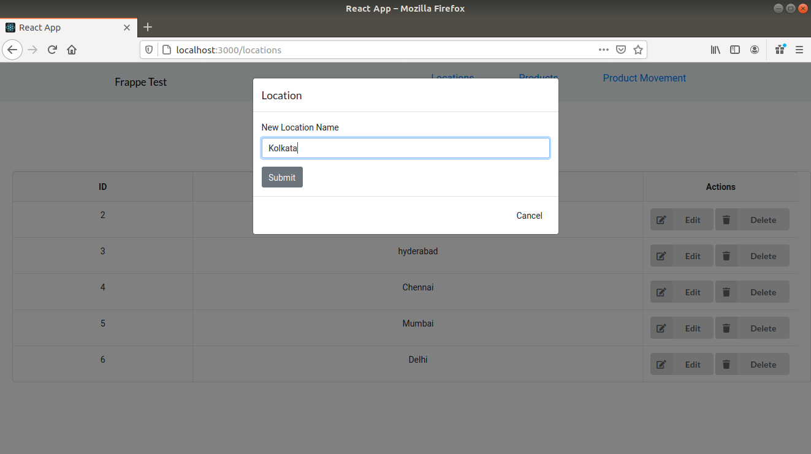

# FrappeTest

## About

- An Inventory Management Application built with Flask, MySQL and React.
- It shows list of products, locations and quantities of product in each location.

## Built Using

- [MySQL](https://www.mysql.com/) - Database
- [ReactJS](https://reactjs.org/) - Web UI Library
- [Flask](https://flask.palletsprojects.com/en/1.1.x/) - Server Environment
- [Reactstrap](https://reactstrap.github.io/) - UI component tool

## File Structure

/flask - Flask Server
/react-frontend - React User Interface

## Screenshots

### Home Page

### Locations Page

### Products Page

### Product Movement Page

### Updating Location

### Importing Item

### Filtering

### Alert

